# Building Real-World AI Agents with Cline and MCP

This guide provides step-by-step instructions for setting up the prerequisites needed for MCP (Model Context Protocol) server creation on macOS and Windows.

## Prerequisites

Before creating an MCP server, ensure you have the following tools installed:

- ✅ Java (SAP Machine JDK)
- ✅ Maven
- ✅ Node
- ✅ Visual Studio Code
- ✅ Cline Extension for VS Code

---

## 1. Java Installation

### 1.1 Java Installation on Mac

#### Step 1.1.1: Install Homebrew

If Homebrew is not available on your machine, install it using:

```bash
/bin/bash -c "$(curl -fsSL https://raw.githubusercontent.com/Homebrew/install/HEAD/install.sh)"
```

Verify Homebrew installation:
```bash
brew -v
```

#### Step 1.1.2: Install Java (SAP Machine JDK 25)

⚠️ **Important**: Request administrator access before running the following command.

```bash
brew install --cask sap/sapmachine/sapmachine25-jdk
```

#### Step 1.1.3: Verify Java Installation

Check if Java is installed correctly:
```bash
java -version
```

#### Step 1.1.4: Setup Java Environment Variable

Add Java environment variable to your shell profile:

```bash
echo export "JAVA_HOME=\$(/usr/libexec/java_home)" >> ~/.zshrc
source ~/.zshrc
```

---

### 1.2 Java Installation on Windows

#### Step 1.1.1: Download SAP Machine JDK

Download SAP Machine JDK from the official site: [SAP Machine JDK](https://sapmachine.io/)
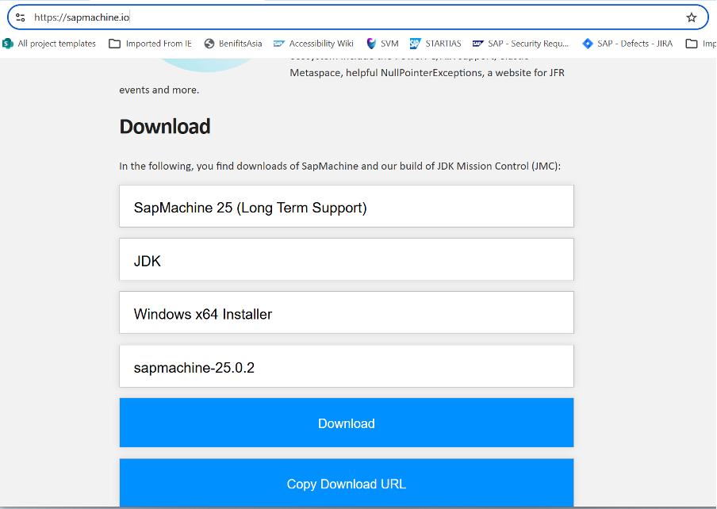

#### Step 1.1.2: Install Java

Run the installer and follow the instructions.
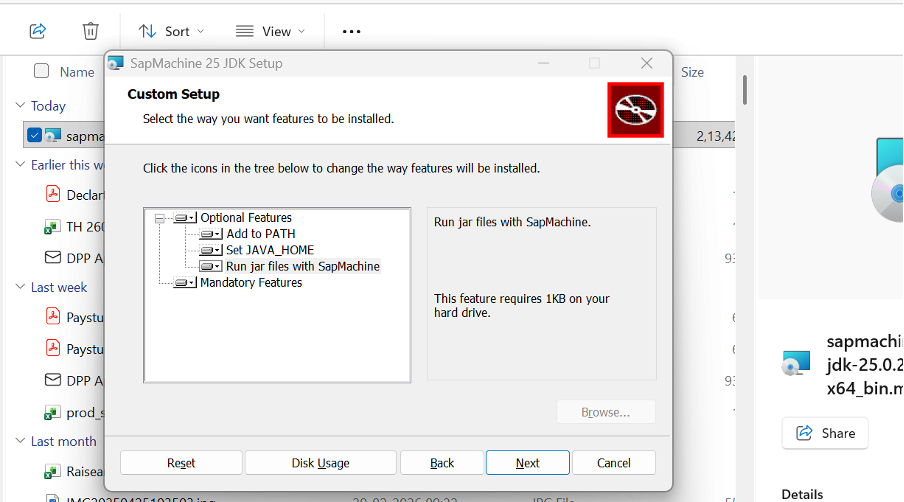

#### Step 1.1.3: Verify Java Installation

Open Command Prompt and check if Java is installed correctly:
```cmd
java -version
```
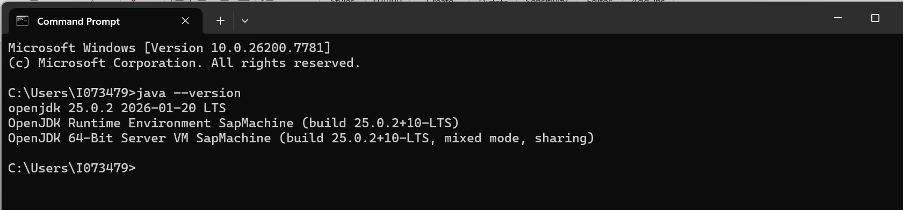

#### Step 1.1.4: Setup Java Environment Variable

1. Right-click on 'This PC' > Properties > Advanced system settings
2. Click on 'Environment Variables'
3. Add JAVA_HOME as a new system variable, pointing to the JDK installation directory.

---

## 2. Maven Installation (3.9.12)

### 2.1 Maven Installation on Mac

#### Step 2.1.1: Install Maven via Homebrew

```bash
brew install maven
```

#### Step 2.1.2: Verify Maven Installation

Execute the following command to check if Maven is installed:

```bash
mvn --version
```

#### Step 2.1.3: Setup Maven Environment Variables

Configure Maven environment variables:

```bash
echo 'export MAVEN_HOME=/usr/local/opt/maven && export PATH=$MAVEN_HOME/bin:$PATH' >> ~/.zshrc && source ~/.zshrc
```

---

### 2.2 Maven Installation on Windows

#### Step 2.2.1: Download and Install Maven

Download Maven from the official site: [Maven](https://maven.apache.org/download.cgi)
Download the ZIP file: [Maven ZIP](https://dlcdn.apache.org/maven/maven-3/3.9.14/binaries/apache-maven-3.9.14-bin.zip)
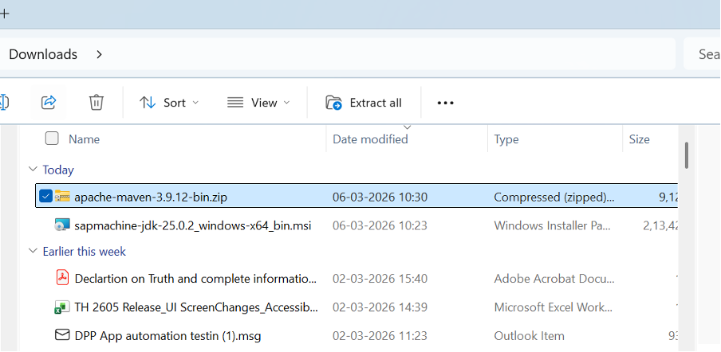

Create a new folder 'tools' under C:\ drive and move the ZIP file into the newly created folder.
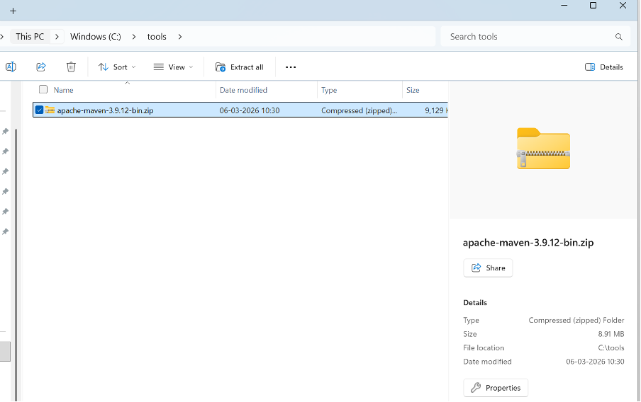

Right-click on the ZIP file and select "Extract All" to extract it under the same current working directory.

#### Step 2.2.2: Setup Maven Environment Variables

Set environment variables by searching "Edit the system environment variables" in Windows search bar.
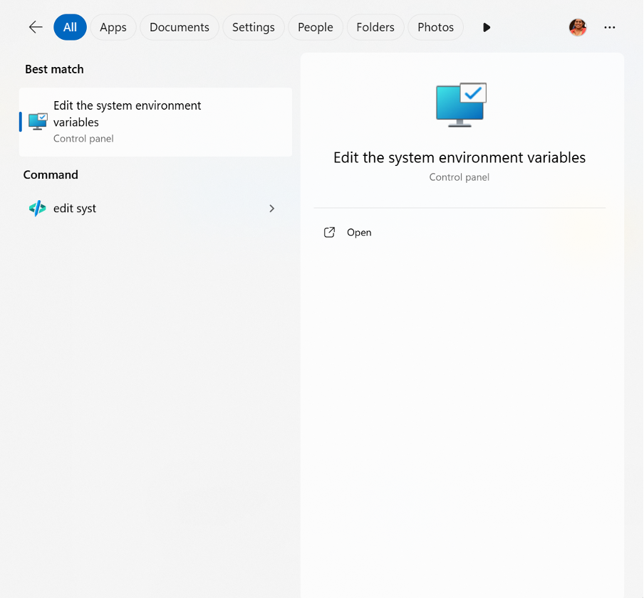

Open "Edit system environment variables".
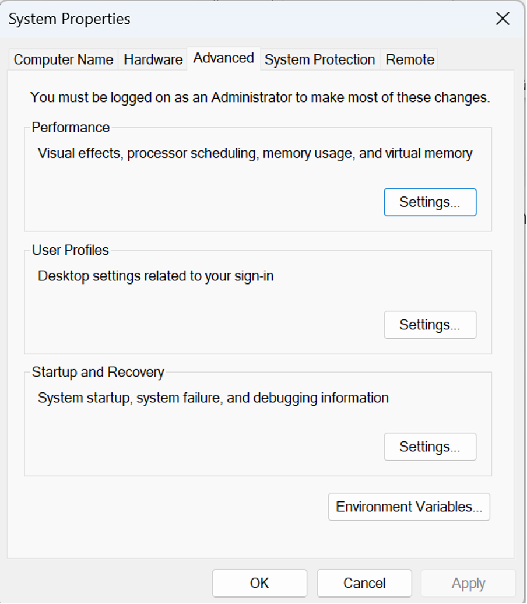
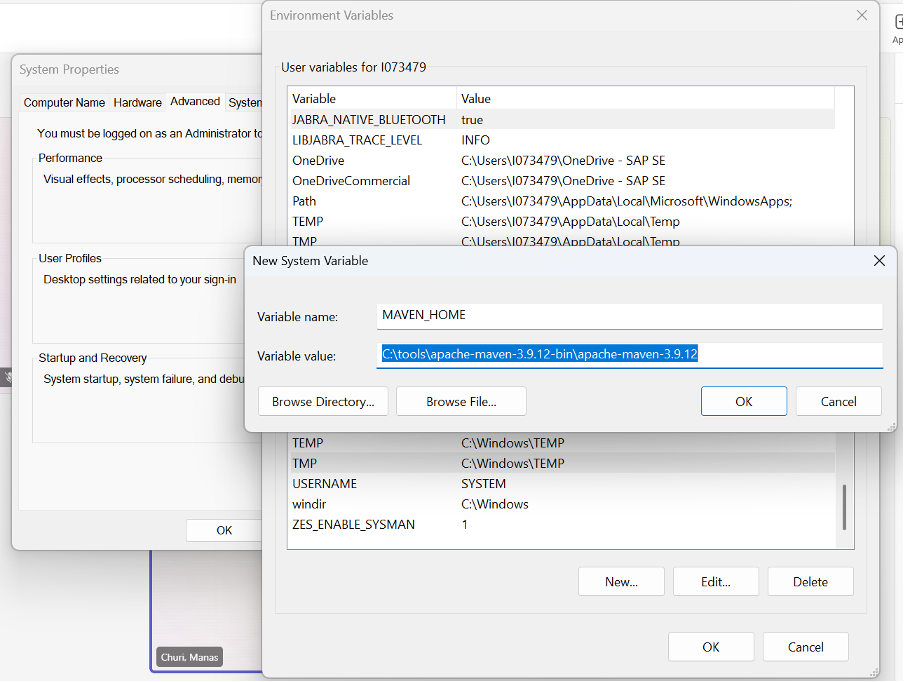

- Variable Name: `MAVEN_HOME`
- Variable Value: `C:\tools\apache-maven-3.9.12-bin\apache-maven-3.9.12`

Next Step: Edit Path variable
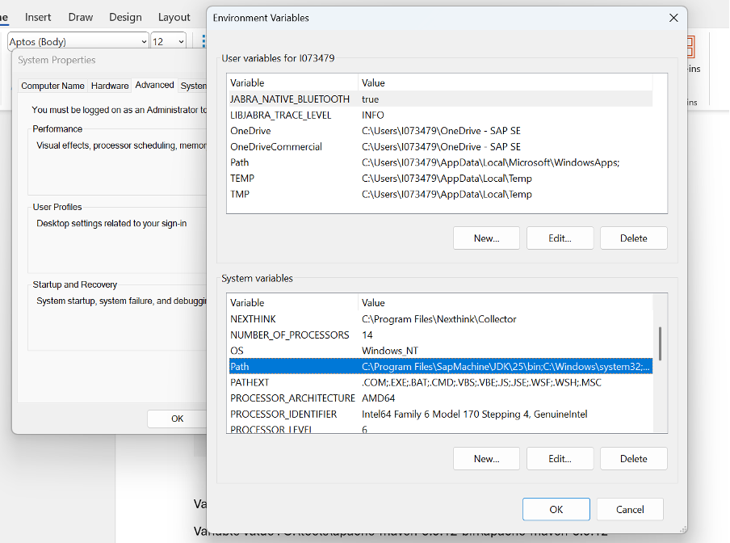
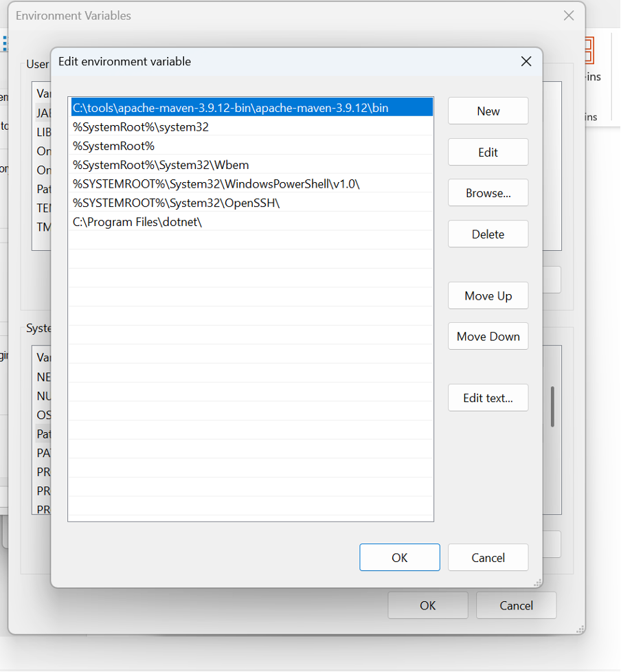

Set Path variable: `C:\tools\apache-maven-3.9.12-bin\apache-maven-3.9.12\bin`

#### Step 2.2.3: Verify Maven Installation

Open Command Prompt and check if Maven is installed correctly:
```cmd
mvn --version
```
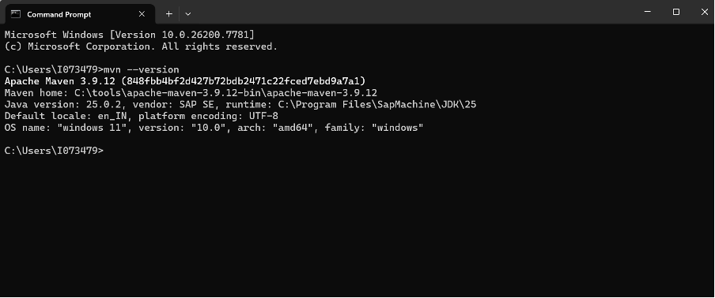

---
## 3. Node Installation

### 3.1 Installation on Mac

#### Step 3.1.1: Node Installation
```cmd

curl -o- https://raw.githubusercontent.com/Homebrew/install/HEAD/install.sh | bash

brew install node@24

```

#### Step 3.1.2: Verify installed node version
```cmd

node -v

```

#### Step 3.1.3: Verify installed npm version
```cmd

npm -v

```

### 3.2 Installation on Windows

#### Step 3.2.1: Download Node from the https://nodejs.org/en/download and run the installable
 

#### Step 3.2.2: Verify installed node version
Open Command Prompt and check if node is installed correctly:
```cmd

node -v

```

#### Step 3.2.3: Verify installed npm version
```cmd

npm -v

```

## 4. Visual Studio Code Installation

### 4.1 Installation on Mac

Install VS Code from the **self service portal**.
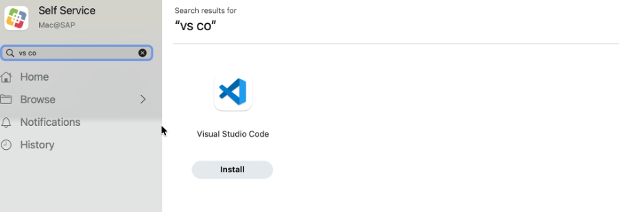

---

### 4.2 Installation on Windows

Open Microsoft Store.
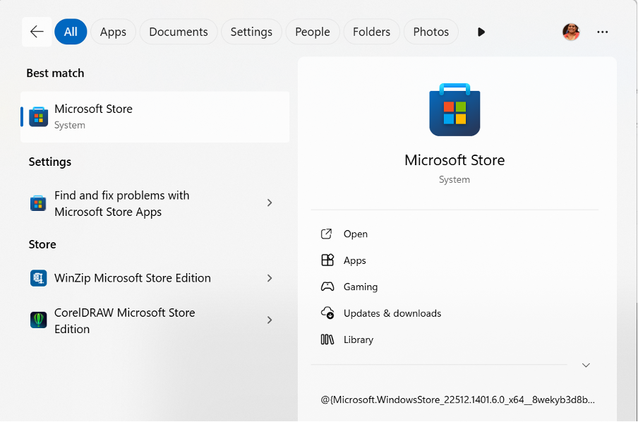

Search for Visual Studio Code and click on 'Install'.
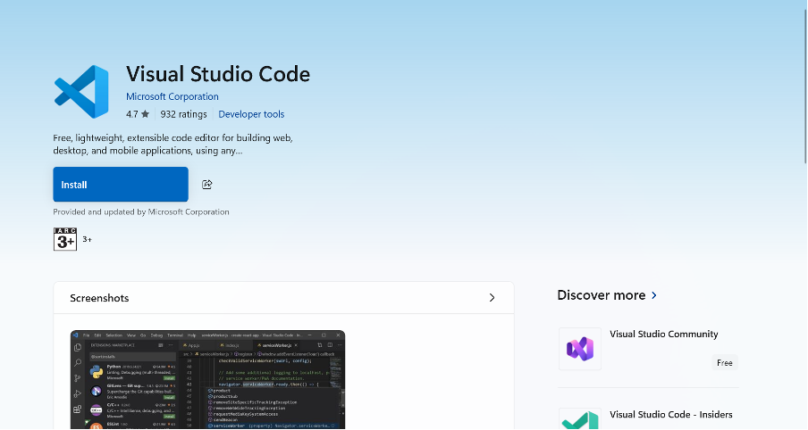

---

## 5. Cline Extension Installation

### Step 5.1: Install Cline Extension in VS Code

1. Open Visual Studio Code
2. Go to Extensions marketplace
3. Search for "Cline"
4. Install the Cline extension
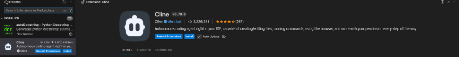

### Step 5.2: API Configuration with AI Core Credentials

Add the following AI Core credentials to your API configuration:
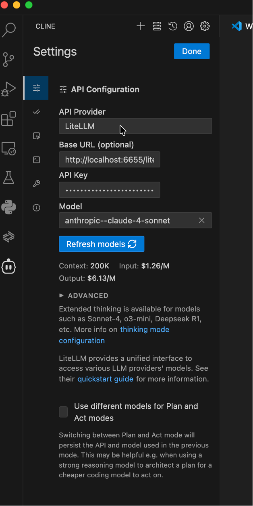

```json
{
    "clientid": "sb-aafadf2b-3149-4e28-a4c0-547e234be013!b18435|xsuaa_std!b318061",
    "clientsecret": "c9a6cdaf-d864-4f29-8712-fdcffad0cb93$35U2umQGTiCng433P674JVlL-vteXy0gWMz6ZhBRHyw=",
    "AI Core Auth URL": "https://ich-dev-eu12.authentication.eu12.hana.ondemand.com",
    "model": "gpt-4o",
    "credential-type": "binding-secret",
    "serviceurls": {
        "AI Core Base URL": "https://api.ai.intprod-eu12.eu-central-1.aws.ml.hana.ondemand.com"
    }
}
```

---

## 5. Clone or Download the Application

To get started with the MCP server application, clone or download the repository from the following link:

- Application Repository: [custom_mcp_development](https://github.tools.sap/d-comIN2026/custom_mcp_development.git)
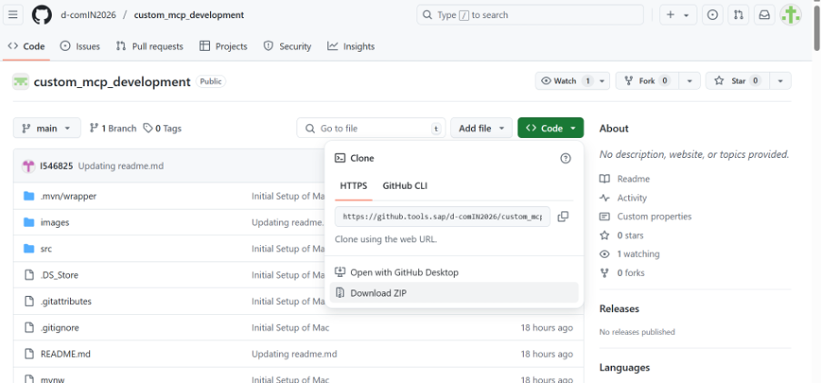

---

## Project Structure Information
- **pom.xml**: Where we are using AI-related libraries. Please add the below xml code snippet inside POM file, under the dependencies section 
- **pom.xml**: The above code is required to bring the required libraries for Spring AI enablement
- **pom.xml**: Add this code snippet at line number 50
```xml
	<dependency>
            <groupId>org.springframework.ai</groupId>
            <artifactId>spring-ai-starter-mcp-server-webmvc</artifactId>
            <version>1.1.0</version>
        </dependency>

	<dependency>
            <groupId>org.apache.maven.resolver</groupId>
            <artifactId>maven-resolver-api</artifactId>
            <version>1.9.18</version>
        </dependency>
 
        <dependency>
            <groupId>org.apache.maven.resolver</groupId>
            <artifactId>maven-resolver-impl</artifactId>
            <version>1.9.18</version>
        </dependency>
 
        <dependency>
            <groupId>org.apache.maven.resolver</groupId>
            <artifactId>maven-resolver-connector-basic</artifactId>
            <version>1.9.18</version>
        </dependency>
 
        <dependency>
            <groupId>org.apache.maven.resolver</groupId>
            <artifactId>maven-resolver-transport-http</artifactId>
            <version>1.9.18</version>
        </dependency>
 
        <dependency>
            <groupId>org.apache.maven</groupId>
            <artifactId>maven-resolver-provider</artifactId>
            <version>3.9.6</version>
        </dependency>

```

- **application.yaml**: We have exposed the MCP server.
- **Copy and paste the below code under the application.yaml file at line number 2
```yaml
spring:
  ai:
    mcp:
      server:
        protocol: STREAMABLE
        name: ich_mcp_server
        version: 1.0.0
        type: SYNC
        instructions: "This streamable server provides real-time notifications"
        resource-change-notification: true
        tool-change-notification: true
        prompt-change-notification: true
        streamable-http:
          mcp-endpoint: /api/mcp
          keep-alive-interval: 30s
```
- **ShoppingCartService.java**: Used for connecting with external services via @tool annotation.
- **ShoppingCartService**: Basicallly the shopping cart provides 3 functionalities, like AddItem, RemoveItem and GetListItems.
- **ShoppingCartService**: AddItem adds items to shopping cart and correspondingly the remove and getlist functionalities removes an iteam and get the list of items accordingly 
- **ShoppingCartService**: External Shopping cart integration with MCP server, please copy the below code and paste under ShoppinCartService.java File
- **ShoppingCartService**: Copy and paste this code at line number 14 in the file ShoppingCartService.java
```java
@Autowired ShoppingCartServiceImpl shoppingCartServiceImpl;

    @Tool(name = "addItem",
        description = "Add an item to the shopping list or update its quantity. Specify item name and quantity.")
    public String addItem(String name, int quantity) {
        return shoppingCartServiceImpl.addItem(name, quantity);
    }
    
    @Tool(name = "getItems",
        description = "Get all items currently in the shopping list. Returns a list of items with their names and quantities.")
    public List<ShoppingItem> getItems() {
        return shoppingCartServiceImpl.getItems();
    }

    @Tool(name = "removeItem",
        description = "Remove a specified quantity of an item from the shopping list. Specify item name and quantity to remove. If quantity is not specified or is greater than item quantity, the item is removed.")
    public String removeItem(String name, int quantity) {
        return shoppingCartServiceImpl.removeItem(name, quantity);
    }
```
- **DkomApplication.java**: For exposing these tools.
```java
@Bean
public ToolCallbackProvider shoppingCartToolCallbacks(ShoppingCartService shoppingCartService) {
	return MethodToolCallbackProvider.builder().toolObjects(shoppingCartService).build();
}
```

---

## 6. Next Steps

Once the application has been downloaded, open the application in Visual Studio Code and follow these next steps:
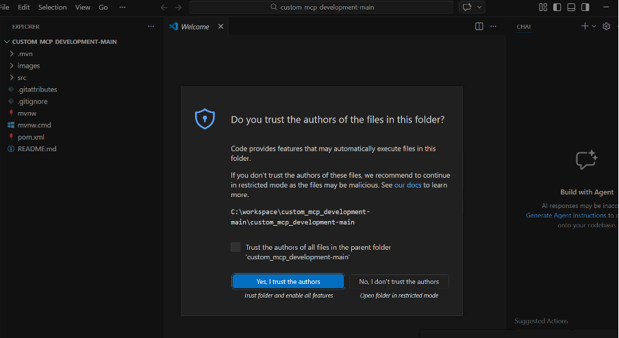

### Step 6.1: Build the Application

Open a new terminal in Visual Studio Code and run the following command:

```bash
mvn clean install
```
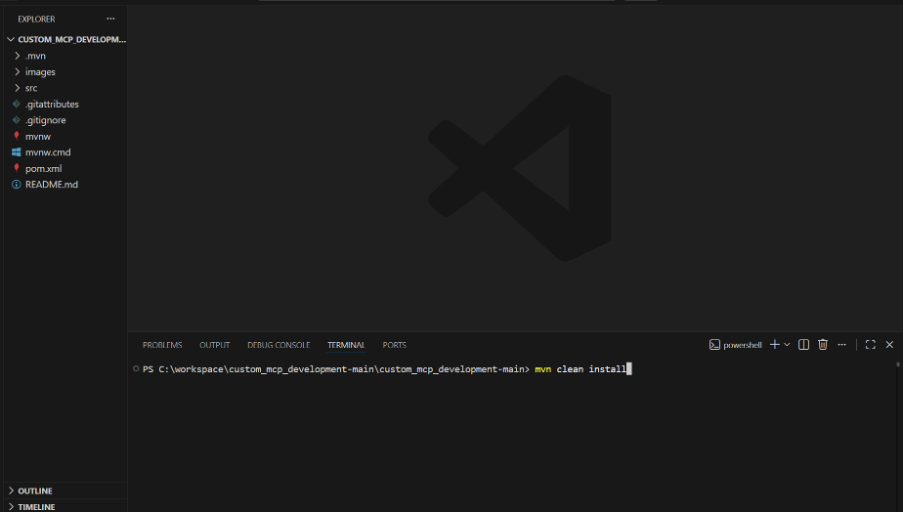

### Step 6.2: Run the Application

Run the following command:

```bash
mvn spring-boot:run
```
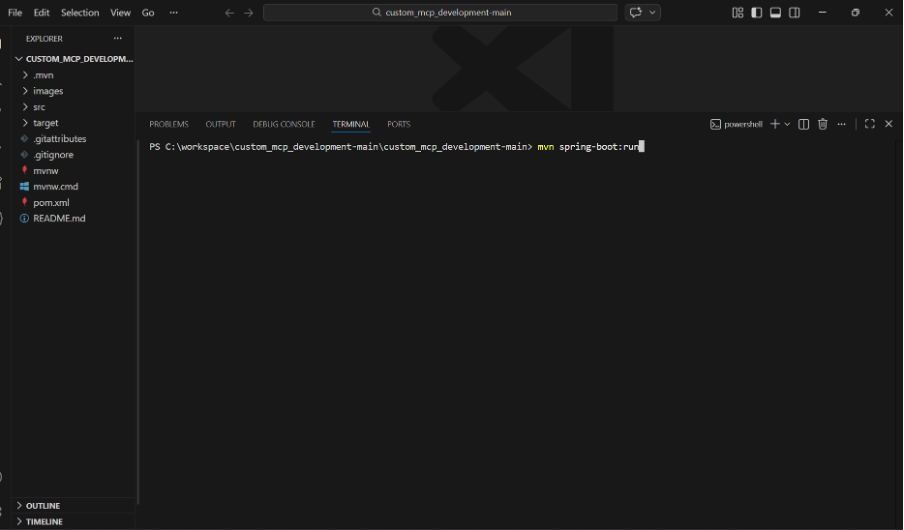

### Step 6.3: Verify Application Response

Once the application is running, open a browser and check if the following URL returns a response: [http://localhost:8080/hello](http://localhost:8080/hello)
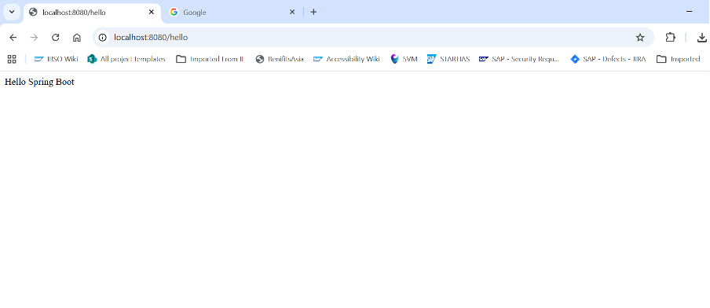

### Step 6.4: Configure MCP Servers in Cline Extension

Open the Cline extension in Visual Studio Code and configure MCP as follows:

1. Click on "Configure MCP Servers".
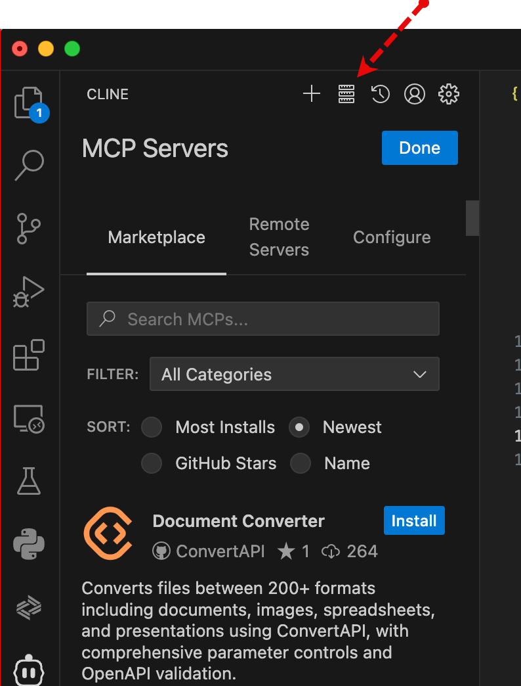
   
2. Add the following configuration in "mcpServers":

```json
"ich_mcp_server_local": {
  "autoApprove": ["addItem","getItems","removeItem"],
  "disabled": false,
  "timeout": 60,
  "type": "streamableHttp",
  "url": "http://localhost:8080/api/mcp"
}
```
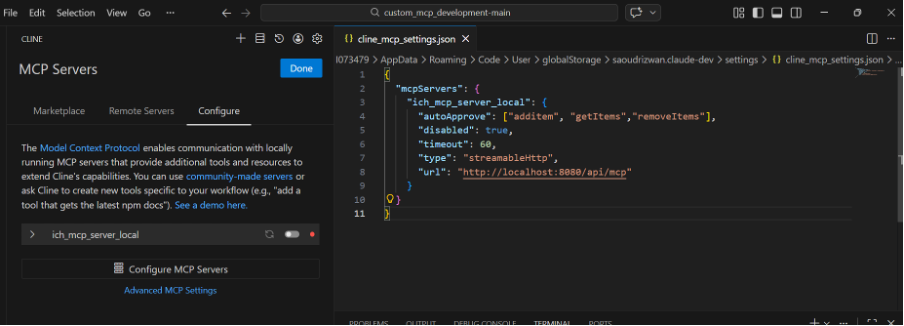

3. Save the file and start the MCP server, then click on Done.

### Step 6.5: Perform Operations in Cline

While the MCP server is running, perform the following instructions in Cline:

- Add one pack of milk
- Add 4 chocolates
- Get items in the shopping cart
- Remove 1 chocolate
- Get items in the shopping cart

**Congratulations! You've created your own MCP server.**

### How to Use MCP Server in Real World

This is a real-life example of how we are using the MCP server with Cline in day-to-day life. It helps connect with external systems such as Black Duck, Jira, and the Maven repository. The MCP server assists in resolving security issues with less human intervention, enhancing capabilities with AI coding assistant Cline, and MCP-based tools that facilitate more efficient vulnerability resolution, closing the loop between detection and remediation.

## Verification Checklist

Before proceeding with MCP server creation, verify all installations:

- [ ] Homebrew installed and working (`brew -v`)
- [ ] Java installed (`java -version`)
- [ ] JAVA_HOME environment variable set
- [ ] Maven installed (`mvn --version`)
- [ ] Maven environment variables configured
- [ ] Visual Studio Code installed
- [ ] Cline extension installed in VS Code
- [ ] Cline properly configured following the documentation
- [ ] MCP Server running
- [ ] Instructions are working in Cline with MCP server

---

## Next Steps

Once all prerequisites are installed and verified, you can proceed with creating your MCP server following the specific server creation documentation.

## Troubleshooting

### Common Issues:

1. **Permission Issues**: Make sure you have administrator access when installing Java
2. **Environment Variables**: Restart your terminal after setting environment variables
3. **Path Issues**: Verify that Maven and Java are in your system PATH
4. **Cline Configuration**: Follow the official documentation links for proper setup

---

## Additional Resources

- [Homebrew Documentation](https://brew.sh/)
- [SAP Machine JDK](https://sap.github.io/SapMachine/)
- [Apache Maven](https://maven.apache.org/)
- [Visual Studio Code](https://code.visualstudio.com/)
- [Cline Documentation](https://pages.github.tools.sap/hAIperspace/hai-docs/)
